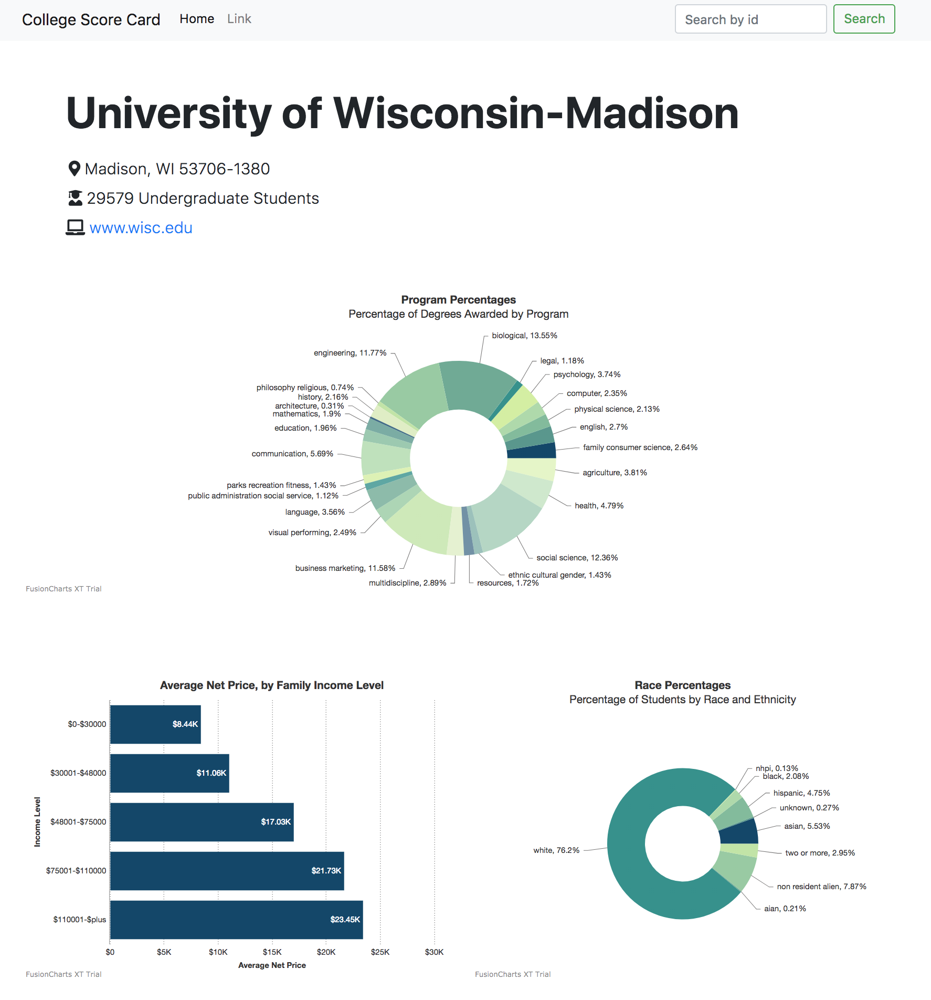

## Description
- A single-page web application to display college information made with React.js.  
- The web app only supports searching school by id right now. School id can be found [here](https://collegescorecard.ed.gov/data/documentation/).
- This project was compiled and optimized for production deployment. `build` folder contains all files for serving.
- Data source: [api.data.gov](https://api.data.gov/)  

## Deployment  
1. Install npm: follow instructions [here](https://www.npmjs.com/get-npm).  
2. Install serve: `npm install -g serve`.
3. Download/Clone `build` folder.
3. Serve the build folder: `serve -s build`.
4. Visit the web application at: [http://localhost:5000](http://localhost:5000).  

## Development  
1. Download/Clone all source files.  
2. Install all dependencies: `npm install`.
3. Add a file named `api_key.js` at root, put your api key in this file. Register api key at [api.data.gov](https://api.data.gov/).
4. Run `npm run build`, the `build` folder will be regenerated.

## Screenshot

